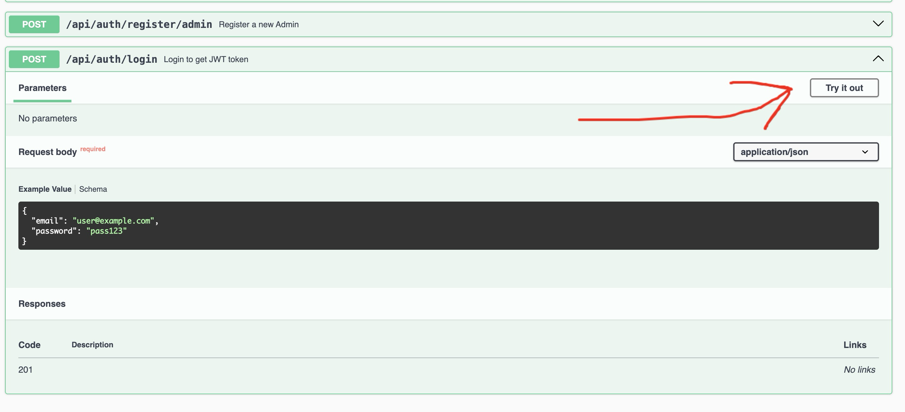
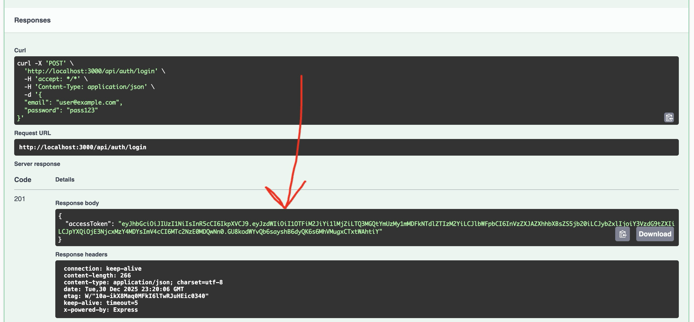
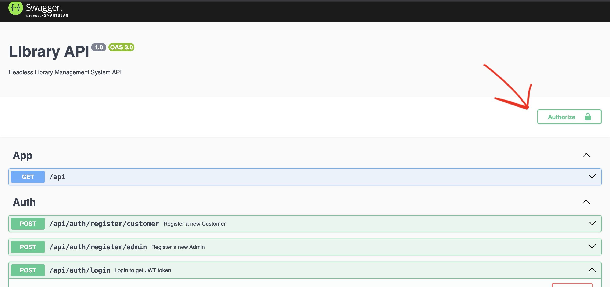
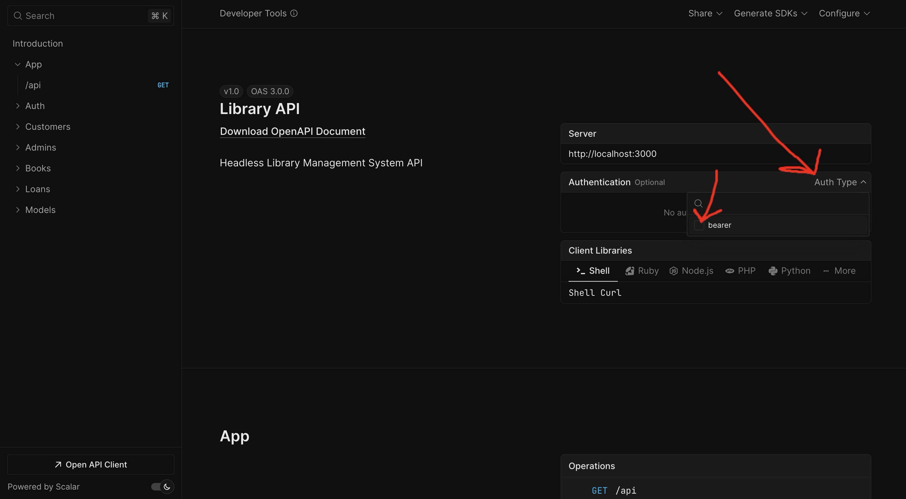
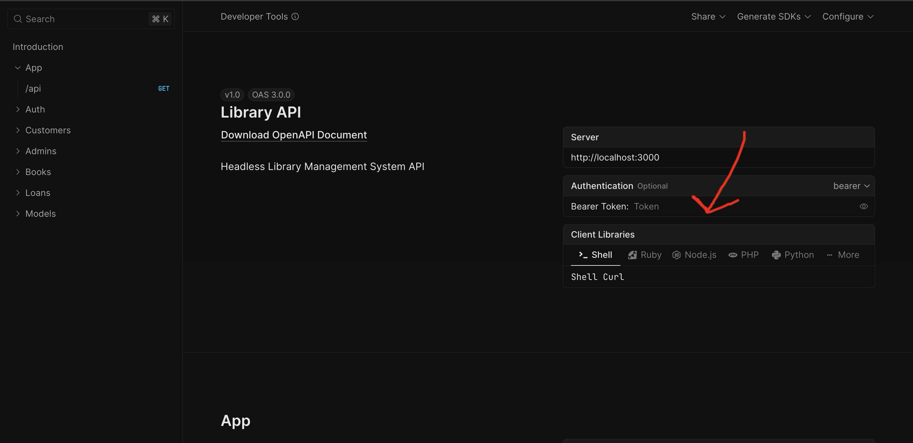

## Run

Open project dir in terminal, then

Install packages
`npm install`

Run seed script (if not initialized, if initialized, skip this step)
`npm run script apps/api/src/seed.ts  `

Run dev server 
`npm run api`

## Documentation / UI for usa

To open API documentation We have two options:

**Old Swagger**

`http://localhost:3000/api/reference`

To use amdin/customer endpoints, first login using login endpoint

Get access token from response

And authorize (button at the top right page corner)

Now you can use admin/customer endpoints

**Modern Scalar**

`http://localhost:3000/api/scalar`

Similar for admin/customer endpoitns you need to authorize
So login and then fill authorization setting on top of page

## Code structure

The main project sourcode is inside `apps/api/src`

For example model for books is inside `apps/api/src/app/books/book.entity.ts` file

DTOs for books is inside `apps/api/src/app/books/dto` dir

We have three main models
- `apps/api/src/app/books`
- `apps/api/src/app/loans`
- `apps/api/src/app/users`

All of them have thier services, models, DTOs, controllers, etc.
